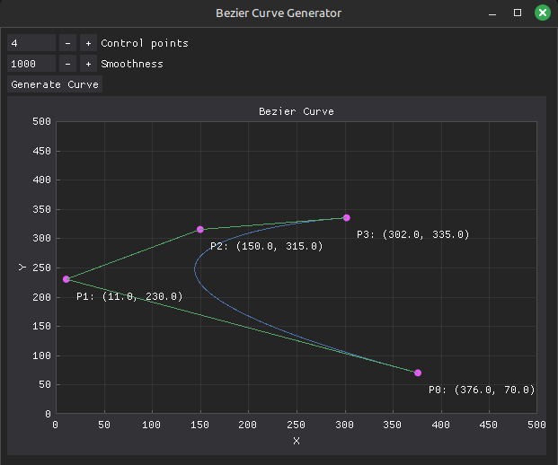

# bezier-curve-simulator
A simple Python program that simulates Bezier curves. Bezier curves are smooth curves generated
by a set of control points. To read more about it, refer to [this link](https://en.wikipedia.org/wiki/B%C3%A9zier_curve#External_links)

The following modules are required to run the program - numpy, dearpygui. To install them, enter
```
pip install numpy dearpygui
```

When you execute the program, enter the number of control points (atleast 2). 
Use the mouse pointer to drag and play around with the points to see how the curve changes 


